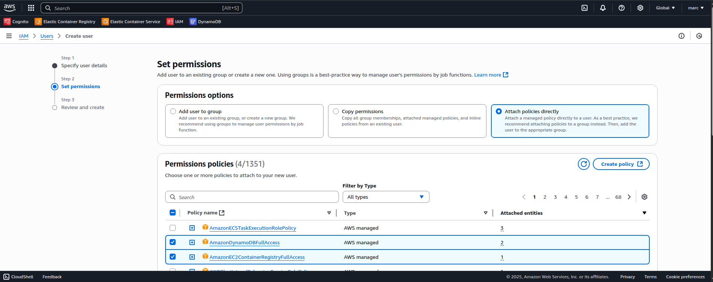

# **PRA#06-FullStack: Renting Car**

---

*Projecte enfocat a l'aprenentatge DevOps mitjançant el desplegament de l'aplicació full-stack rentingCar amb GitHub Actions, Docker Hub i AWS ECS Fargate.*

---

### Context inicial

Per començar aquest projecte, he fet un fork del repositori original: [GitHub - marcius02/rentingCar at feature/ci-cd-setup](https://github.com/marcius02/rentingCar/tree/feature/ci-cd-setup). L'objectiu principal és crear una pipeline de CI/CD utilitzant GitHub Actions, Docker Hub i Amazon ECS Fargate.

En aquest document markdown he escrit pas a pas els problemes i solucions trobades durant la creació de la pipeline.

La regió amb la qual treballo a AWS és: eu-central-1. L'aplicació es connecta amb DynamoDB, amb dues taules:

- `Users` (partition key: userId, sort key: operation)
- `Delegations` (partition key: delegationId, sort key: operation)

---

### **Configuració de la branca**

Abans de començar, creo una branca feature:

```bash
git checkout -b feature/ci-cd-setup
```

Això em permet aïllar els canvis del CI/CD fins que estiguin complets i verificats.

---

### **Pas 1: Integració Contínua amb GitHub Actions**

Per iniciar el procés CI/CD, començo configurant la **Continuous Integration (CI)** amb GitHub Actions. El CI és important perquè assegura que cada canvi enviat al repositori es verifica automàticament mitjançant la compilació i proves del codi. Això ajuda a detectar problemes d’integració aviat.

Creo un fitxer de workflow a `.github/workflows/ci.yml`. Aquest fitxer defineix la seqüència de passos automatitzats que GitHub executa cada vegada que faig un *push* o un *pull request* al repositori.

#### **Per què GitHub Actions?**

* GitHub Actions està completament integrat amb GitHub i no requereix eines de CI de tercers.

* És gratuït per a repositoris públics i fàcil per a principiants.

* Ofereix accés a un mercat d’accions predefinides (com *checkout* de codi, configuració de Java, etc.).

#### **Trigger del CI (Quan s’executa?)**

```yaml
on:
  push:
    branches:
      - master
      - feature/ci-cd-setup
  pull_request:
    branches:
      - master
```

#### **Resum del Job CI (`build-and-test`)**

```yaml
jobs:
  build-and-test:
    runs-on: ubuntu-latest
    permissions:
      contents: write
    steps:
      - name: Check out repository
        uses: actions/checkout@v4

      - name: Set up JDK 21
        uses: actions/setup-java@v4
        with:
          java-version: '21'
          distribution: 'temurin'

      - name: Set up Node.js
        uses: actions/setup-node@v4
        with:
          node-version: '20.x'

      - name: Build and test backend (generate frontend files)
        working-directory: ./rentingCar
        run: mvn clean verify -Pproduction

      - name: Install frontend dependencies
        working-directory: ./rentingCar
        run: npm ci

      - name: Build frontend
        working-directory: ./rentingCar
        run: npm run build
```

### Què fa aquesta pipeline CI?

La pipeline CI executa els següents passos:

1. **Checkout del codi**: Assegura que el codi font estigui disponible

2. **Instal·lo JDK 21** – Necessari per compilar i empaquetar el backend Spring Boot.

3. **Instal·lo Node.js 20** – Requerit per executar Vite i gestionar les dependències del frontend.

4. **Executo la compilació Maven** – Compila el backend i genera els fitxers del frontend (mitjançant el plugin Vaadin).

5. **Instal·lo les dependències del frontend** – Assegura que els paquets de Node estiguin disponibles.

6. **Compilo el frontend** – Utilitzo `vite build` per compilar els recursos estàtics.

#### **Per què Maven abans que Vite?**

Executo Maven (`mvn verify -Pproduction`) primer perquè Vaadin integra les eines de construcció del frontend en el cicle de vida del backend. Això genera la sortida necessària a `frontend/generated`. Executar Vite abans provocaria fitxers absents.

#### **Per què utilitzo working-directory?**

Cada job a GitHub Actions s’executa des de l’arrel del repositori. Com que el projecte real es troba al subdirectori `rentingCar`, totes les comandes han d’especificar aquest directori. En lloc de repetir rutes en cada comanda, faig servir `working-directory: ./rentingCar` quan és necessari.

#### **Correcció: Error de script `build` absent**

Inicialment, el workflow falla amb:

```
npm error Missing script: "build"
```

[ci: add basic CI workflow for backend and frontend build · marcius02/rentingCar@d6641f5 · GitHub](https://github.com/marcius02/rentingCar/actions/runs/15321824395/job/43107116219)

Per solucionar-ho, actualitzo el fitxer `package.json`:

```json
"scripts": {
  "build": "vite build"
}
```

Després de fer *push*, el workflow CI funciona correctament.
[ci: add missing build script to package.json · marcius02/rentingCar@be02075 · GitHub](https://github.com/marcius02/rentingCar/actions/runs/15322018759)

---

### **Pas 2: Creació del Dockerfile**

Un cop el codi es compila i el frontend es construeix amb èxit, el següent pas és containeritzar l’aplicació. Creo un `Dockerfile` multi-stage dins del directori `rentingCar` per produir una imatge optimitzada per a l’execució.

#### **Per què Docker?**

* Els contenidors asseguren que l’aplicació funciona igual en tots els entorns.

* Empaqueten dependències, artefactes de compilació i configuració en una sola unitat desplegable.

* ECS Fargate pot executar contenidors Docker directament sense gestionar servidors.

#### **Per què una construcció Multi-Stage?**

Les construccions multi-stage redueixen la mida de la imatge final separant les dependències de compilació (com Maven, Node.js, etc.) del contingut d’execució.

#### **Explicació del Dockerfile**

Aquest és el Dockerfile que utilitzo:

```dockerfile
# Stage 1: Build backend and frontend
FROM maven:3.9.6-eclipse-temurin-21 AS build
WORKDIR /app
COPY . .
RUN mvn clean verify -Pproduction

# Stage 2: Run the application
FROM eclipse-temurin:21-jre
WORKDIR /app
COPY --from=build /app/target/*.jar app.jar
EXPOSE 8080
ENTRYPOINT ["java", "-jar", "app.jar"]
```

##### **Stage 1: Fase de construcció**

* **Imatge base:** `maven:3.9.6-eclipse-temurin-21` inclou JDK 21 i Maven.

* **`COPY . .`** porta el codi font al contenidor.

* **`mvn clean verify -Pproduction`** compila, prova i empaqueta l’aplicació. El mode de producció de Vaadin construeix tant el backend com el frontend.

##### **Stage 2: Fase d’execució**

* **Imatge base:** `eclipse-temurin:21-jre` és una imatge mínima de runtime Java.

* **`COPY --from=build`** porta només el fitxer `.jar` compilat des del constructor.

* **`ENTRYPOINT`** inicia l’aplicació.

* **`EXPOSE 8080`** indica el port de l’aplicació a orquestradors externs.

El multi-stage optimitza la mida de la imatge separant els entorns de construcció i execució.

El contenidor ja està llest per ser construït i enviat a un registre en el següent pas.

#### **Per què Temurin?**

Eclipse Temurin és el successor d’AdoptOpenJDK i és suportat oficialment per molts proveïdors de núvol. Proporciona compilacions de Java de codi obert llestes per a producció.

---

### **Pas 3: Construeixo i envio la Imatge Docker**

Després de construir la *Docker image*, el següent pas en la pipeline CI/CD és automatitzar la creació i distribució de la imatge utilitzant GitHub Actions.

#### **Per què enviar a Docker Hub?**

* Docker Hub actua com un registre centralitzat on s’emmagatzemen les imatges de contenidors i es poden accedir des de qualsevol entorn.

* ECS Fargate pot fer *pull* de les imatges des de Docker Hub sense necessitat de configurar una VPC privada.

* GitHub Actions s’integra fàcilment amb Docker Hub mitjançant *secrets*.

#### **Job de GitHub Actions: `docker-image`**

Aquest job s’afegeix al *workflow file* després del job `build-and-test`. Construeix la *Docker image* i l’envia a Docker Hub només si els passos anteriors de CI tenen èxit.

```yaml
docker-image:
  needs: build-and-test
  runs-on: ubuntu-latest
  steps:
    - name: Check out repository
      uses: actions/checkout@v4

    - name: Log in to Docker Hub
      uses: docker/login-action@v3
      with:
        username: ${{ secrets.DOCKER_USERNAME }}
        password: ${{ secrets.DOCKER_TOKEN }}

    - name: Build Docker image
      working-directory: ./rentingCar
      run: docker build -t ${{ secrets.DOCKER_USERNAME }}/rentingcar:latest .

    - name: Push Docker image
      run: docker push ${{ secrets.DOCKER_USERNAME }}/rentingcar:latest
```

#### **Explicació de cada Pas:**

* **Check out repository:** Assegura que el codi font estigui disponible.

* **Log in to Docker Hub:** Utilitza credencials emmagatzemades de manera segura com a GitHub Secrets (`DOCKER_USERNAME`, `DOCKER_TOKEN`).

* **Build image:** Utilitza el Dockerfile dins del directori `rentingCar`.

* **Push image:** Publica la imatge etiquetada a Docker Hub amb l’etiqueta *latest*.

#### **Beneficis d’aquesta estructura:**

* Manté la lògica de construcció Docker separada dels passos de compilació Maven/NPM.

* Assegura que només el codi provat s'empaqueta i es publica.

* Minimitza l’acoblament entre les etapes de CI i desplegament, millorant la depuració.

Un cop la imatge es publica a Docker Hub, està llesta per al desplegament a AWS ECS en el següent pas.

---

### **Pas 4: Configuro AWS per al *deploy***

Després de containeritzar l’aplicació i enviar la imatge a Docker Hub, el següent pas és configurar els recursos d’AWS que permeten el desplegament automàtic.

Decideixo utilitzar **AWS ECS Fargate**, un servei de contenidors *serverless* que em permet executar contenidors sense gestionar la infraestructura EC2.

#### **Eines utilitzades en aquest pas:**

* **AWS IAM** per a la gestió d’accés

* **AWS ECS** per definir serveis i executar tasques

* **GitHub Secrets** per emmagatzemar les credencials d’AWS de manera segura

---

#### **Per què creo un usuari IAM específic per a GitHub Actions?**

AWS recomana no utilitzar el compte *root* per a desplegaments. En lloc d’això, creo un usuari IAM específicament per a finalitats de CI/CD. Aquest usuari només té els permisos necessaris per aquest projecte i es pot eliminar sense afectar l'usuari *root*.

**Usuari IAM: `github-actions-deployer`**

* **Tipus d’accés:** Només accés programàtic (mitjançant Access Key i Secret Access Key)

* **Polítiques Associades:**
  
  * `AmazonECS_FullAccess`: per gestionar serveis ECS
  
  * `AmazonEC2ContainerRegistryFullAccess`: per a un possible ús d’ECR en el futur
  
  * `AmazonDynamoDBFullAccess`: per assegurar que les tasques puguin interactuar amb DynamoDB
  
  * `CloudWatchLogsFullAccess`: perquè els logs es puguin enviar per a depuració




Aquests permisos són suficients per permetre a ECS llançar contenidors i al servei desplegat llegir/escriure a DynamoDB.

Un cop creat l'usuari IAM, creo les access key per després guardar-les al següent pas:


---

#### **Afegir credencials a GitHub Actions**

Creo dos *secrets* al repositori de GitHub:

* `AWS_ACCESS_KEY_ID`

* `AWS_SECRET_ACCESS_KEY`

Aquests s’utilitzen en els workflows de GitHub Actions per autenticar les comandes de l’AWS CLI durant el *deploy*.

Passos:

1. Anar al repositori de *rentingCar* > *Settings* > *Security* > *Secrets and variables* > *Actions*

2. On *Repository secrets* clicar a "*New repository secret*"

3. Introduïr el nom i el valor per a cada credencial

---

#### **Configuració de la infraestructura mitjançant la consola**

Tot i que inicialment tinc pensat utilitzar la CLI per a tot, canvio a l'nterfície basada en web per a una millor visibilitat i aprenentatge. Només configuro el cluster a través de la CLI:

* **Clúster ECS**: `rentingcar-cluster`
  
  

* **Definició de la *task***: `rentingcar-task` amb la imatge del contenidor des de Docker Hub
  
  
  
  
  
  M'asseguro que el contenidor desplegat reflecteixi la imatge Docker més recent.
  
  
  

* **Servei ECS**: `rentingcar-service` per executar el contenidor
  
  
  
  
  
  
  
  
  
  

---

### **Pas 5: Corregeixo l’error de hashing del frontend causat per un context insegur**

Després de fer el *deploy* de l’aplicació i carregar la llista de cotxes amb èxit, trobo un error al client quan intento reservar un cotxe:

```
TypeError: Cannot read properties of undefined (reading 'digest')
```

#### **Què falla?**

L’aplicació utilitza l’API Web Crypto mitjançant `crypto.subtle.digest()` en el component React del frontend. Aquest mètode requereix que el navegador estigui en un **context segur**—ja sigui `https://` o `localhost`.

Com que provo en una **IP pública amb HTTP**, la crida a l’API falla i el hash de la reserva no es genera.

#### **Per què s’utilitza aquesta funció?**

La lògica original intenta crear un hash SHA-256 basat en els atributs del cotxe i l’ID de l’usuari per generar un ID de reserva únic:

```javascript
const hashBuffer = await crypto.subtle.digest(
  'SHA-256',
  encoder.encode(`${data.make}-${data.model}-${date}-${userId}`)
);
```

Tot i que és vàlid, aquest enfocament només funciona en entorns HTTPS.

#### **Solució escollida: Canvio a `crypto-js`**

Per mantenir la infraestructura senzilla (sense balancejador de càrrega ni HTTPS encara), substitueixo Web Crypto per [`crypto-js`](https://www.npmjs.com/package/crypto-js), una biblioteca de hashing compatible amb JavaScript que funciona en qualsevol context.

##### **Codi actualitzat**

```javascript
import SHA256 from 'crypto-js/sha256';

function generateBookingHash(data) {
  const date = new Date().toISOString().split('T')[0];
  return SHA256(`${data.make}-${data.model}-${date}-${data.userId}`).toString();
}
```

##### **Comandes executades**

```bash
npm install crypto-js
npm install --save-dev @types/crypto-js
```

##### **Error detectat durant el CI**

Inicialment, m'oblido d'executar `npm run build` abans de fer *push* dels canvis. El workflow de GitHub falla amb:

```
TS7016: Could not find a declaration file for module 'crypto-js/sha256'
```

[fix(frontend): switch to crypto-js for booking hash generation · marcius02/rentingCar@d90e2af · GitHub](https://github.com/marcius02/rentingCar/actions/runs/15344544860)

Per solucionar-ho, instal·lalo el paquet `@types/crypto-js` i recompilo el frontend localment abans de fer *commit*.

##### **Missatges de commit finals**

```bash
git commit -m "fix(frontend): switch to crypto-js for booking hash generation"
git commit -am "chore(types): add type declarations for crypto-js"
```

Després de fer *push*, el CI passa, la *Docker image* es recompila i es desplega, i la funció de reserva funciona com s’espera en producció.

[chore(types): add type declarations for crypto-js · marcius02/rentingCar@2c087b7 · GitHub](https://github.com/marcius02/rentingCar/actions/runs/15344750485)

---

### **Pas 6: Automatitzo el *deploy* a ECS**

Després de configurar el clúster ECS, la *task* i el servei, observo que a l'hora de fer *push* de noves *docker images* a Docker Hub no desencadena automàticament el desplegament d’aquestes actualitzacions a ECS.

#### **Problema**

Per defecte, ECS no fa *pull* ni redeplega automàticament les imatges etiquetades amb `:latest`. Això provoca un problema on la pipeline CI construeix i envia una nova imatge, però ECS continua servint la versió antiga.

#### **Solució**

Per assegurar que ECS desplega sempre la imatge més recent, afegeixo un job final al workflow de GitHub Actions anomenat `deploy-to-ecs`. Aquest job indica explícitament a ECS que faci un **force redeployment**, el qual desencadena que el servei faci *pull* i executi la imatge més recent de Docker Hub.

#### **Job de GitHub Actions: `deploy-to-ecs`**

```yaml
deploy-to-ecs:
  needs: docker-image
  runs-on: ubuntu-latest
  steps:
    - name: Configure AWS credentials
      uses: aws-actions/configure-aws-credentials@v4
      with:
        aws-access-key-id: ${{ secrets.AWS_ACCESS_KEY_ID }}
        aws-secret-access-key: ${{ secrets.AWS_SECRET_ACCESS_KEY }}
        aws-region: eu-central-1

    - name: Force new deployment in ECS
      run: |
        aws ecs update-service \
          --cluster rentingcar-cluster \
          --service rentingcar-service \
          --force-new-deployment
```

#### **Per què funciona?**

L’opció `--force-new-deployment` fa que ECS reiniciï la tasca o tasques del servei, fins i tot si la *task definition* no ha canviat.

#### **Com verificar que funciona**

* Es mira l'apartat **Events** del Servei ECS i:
  
  * `service rentingcar-service has started 1 tasks`
  
  * `deployment completed`

* Esperem uns segons i es prova l’aplicació de nou utilitzant la IP pública de la nova tasca

* La reserva ara funciona sense errors (per exemple, el hashing funciona, les dades es guarden)

### <mark> **Cicle CI/CD completat**</mark>

##### **Aquest pas completa el cicle CI/CD: des de fer *push* del codi → a Docker Hub → al desplegament en producció a ECS**


---

## **Gestió d’errors i solucions**

Al llarg del procés d’implementació de la pipeline CI/CD i el desplegament de l’aplicació a AWS, he trobat diversos errors i configuracions incorrectes. En aquest apartat es descriu els errors principals, les seves causes i els passos que segueixo per resoldre’ls.

#### **Error 1: Script `build` absent a package.json**

**Missatge:**

```
npm error Missing script: "build"
```

**Causa:**  
El fitxer `package.json` del frontend no defineix un script `build`, la qual cosa fa que el pas `npm run build` del workflow CI de GitHub Actions falli.

**Correcció:**  
Afegeixo l’entrada següent a la secció `scripts` de `package.json`:

```json
"scripts": {
  "build": "vite build"
}
```

Això permet que el frontend es compili correctament durant el CI.

#### **Error 2: Error de hashing del frontend a causa de la restricció HTTPS**

**Missatge:**

```
TypeError: Cannot read properties of undefined (reading 'digest')
```

**Causa:**  
L’aplicació utilitza l’API Web Crypto (`crypto.subtle.digest`), que no està disponible en connexions HTTP insegures. Els desplegaments d’ECS Fargate són HTTP per defecte si no estan darrere d’un ALB.

**Correcció:**  
Canvio de Web Crypto a `crypto-js`, que no requereix un context segur:

```javascript
import SHA256 from 'crypto-js/sha256';

function generateBookingHash(data) {
  const date = new Date().toISOString().split('T')[0];
  return SHA256(`${data.make}-${data.model}-${date}-${data.userId}`).toString();
}
```

Instal·lo els paquets:

```bash
npm install crypto-js
npm install --save-dev @types/crypto-js
```

#### **Error 3: La *task* no es pot connectar a DynamoDB**

**Missatge (logs de CloudWatch):**

```
software.amazon.awssdk.core.exception.SdkClientException: Unable to load credentials from any of the providers in the chain
```

**Causa:**  
Tot i que la *task* d'ECS té un rol d’execució, el camp `task role` està buit. Sense un rol de tasca, l’SDK d’AWS dins del contenidor no pot autenticar-se.

**Correcció:**  
Es crea una nova revisió de la *task definition* i configuro explícitament:

* **Task Role:** `rentingcar-task-execution-role`

* **Task Execution Role:** També `rentingcar-task-execution-role`

Això li dona a l’aplicació permisos per llegir i escriure a DynamoDB.

#### **Error 4: ECS No torna a fer el *deploy* després d’una nova *docker image***

**Observació:**  
Després de fer *commit* de nous canvis i enviar una imatge Docker, el servei ECS encara serveix la versió antiga.

**Causa:**  
ECS no fa *pull* automàticament de la imatge actualitzada etiquetada com `:latest` sense un trigger.

**Correcció:**  
Afegeixo un tercer job (`deploy-to-ecs`) al workflow de GitHub Actions que executa `aws ecs update-service --force-new-deployment` perquè així s'asseguri de que utilitza la imatge més recent.

---